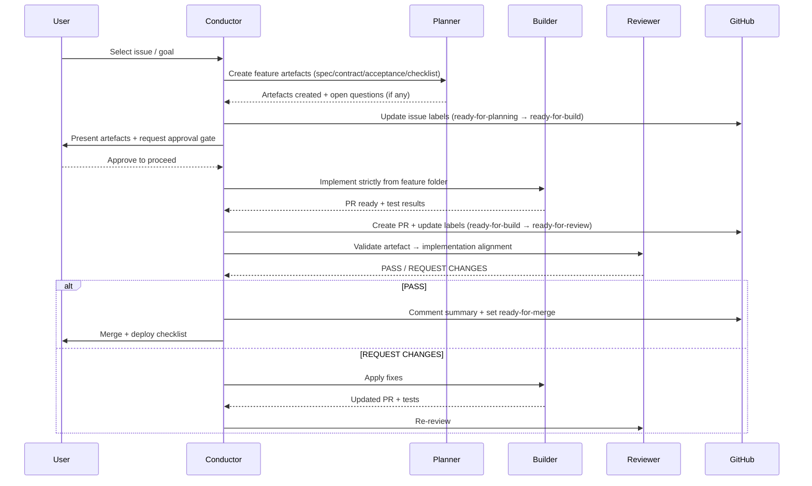
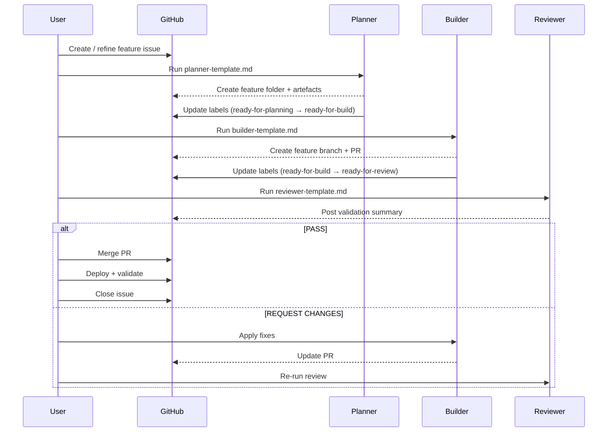

# AI Delivery Engine Template

A governance-first multi-agent delivery workflow for building software safely with AI assistance.

This repository provides structured templates, agent definitions, and workflow conventions for delivering features using a deterministic lifecycle:

```
Discovery → Backlog Generation → Planning → Implementation → Review → Merge & Deploy
```

Unlike agent orchestration systems that focus purely on code generation, this template focuses on:

- Delivery governance
- Feature traceability
- Capability mapping
- Safe and auditable AI-assisted development

The system is compatible with multi-agent orchestration tools but does not require them.

---

## Architecture Overview

The workflow is built around a documentation-driven delivery architecture:

```
Product Brief / Goal
        ↓
current-state.md
        ↓
Backlog Generator
        ↓
Feature Documentation Set
(spec / contract / acceptance / checklist / decisions)
        ↓
Builder Implementation
        ↓
Reviewer Validation
        ↓
Merge + Deployment Validation
```

## Execution Workflow Models

### Agent interaction flow (optional orchestration)

If you use orchestration (for example, a Conductor agent), the lifecycle typically looks like this:



---

### Manual execution flow (template-driven)

If orchestration agents are not used, the same lifecycle can be executed manually using the `.ai/` templates and GitHub workflow discipline:



Manual execution is recommended for:

- Early adoption
- Smaller teams
- Organisations introducing governance gradually

Agent orchestration is recommended for:

- Large codebases
- Parallel development
- Teams requiring automated lifecycle enforcement
---

Notes:
- Orchestration is optional. You can run the same workflow by copy-pasting the templates in `.ai/`.
- Issue closure should happen only after merge and deployment validation.

Each feature is controlled through a **feature folder** located at:

```
/docs/features/<feature-name>/
```

This folder becomes the single source of truth for that feature.

---

## Key Features

- Documentation-first delivery governance
- Deterministic feature lifecycle
- Artefact authority hierarchy
- Capability-driven backlog generation
- Human-in-the-loop approval gates
- CLI-first automation support
- Optional multi-agent orchestration support

---

## Quick Start

1. Create or generate a `current-state.md` snapshot using `current-state-template.md`
2. Generate prioritised backlog items using `backlog-generator-template.md`
3. Select an issue and run `planner-template.md`
4. Implement using `builder-template.md`
5. Validate using `reviewer-template.md`

6. Merge only after Reviewer PASS and deployment validation

### Setup GitHub Issue Lifecycle Labels (CLI)

Run the following commands once per repository to create the delivery lifecycle labels:

```bash
gh label create ready-for-planning --color 0E8A16 --description "Feature is ready for planning"
gh label create ready-for-build --color FBCA04 --description "Planner artefacts completed and ready for implementation"
gh label create ready-for-review --color 1D76DB --description "Implementation completed and ready for review"
gh label create ready-for-merge --color 5319E7 --description "Review passed and ready for merge"
gh label create done --color 2CBE4E --description "Feature merged, deployed, and validated"
```

Notes:
- These labels support lifecycle enforcement and delivery gates.
- Labels only need to be created once per repository.
- Adjust colours or descriptions if your organisation has existing conventions.

---

## Workflow Roles

This template defines three core delivery roles.

| Role | Responsibility |
| --- | --- |
| Planner | Converts backlog issues into structured feature documentation |
| Builder | Implements features strictly from documentation artefacts |
| Reviewer | Validates implementation safety, traceability, and completeness |

These roles can be executed manually, through prompt templates, or through agent orchestration.

---

## Role and Agent Mapping

| Governance Role | Template | Agent |
|---|---|---|
| Planner | planner-template.md | planning-subagent.agent.md |
| Builder | builder-template.md | implement-subagent.agent.md |
| Reviewer | reviewer-template.md | code-review-subagent.agent.md |
| Orchestrator | README workflow | conductor.agent.md |

---

## Artefact authority hierarchy

The feature documentation set is the **source of truth**. When there is a conflict between artefacts, the following hierarchy applies:

```text
decisions.md  >  contract.md  >  spec.md + acceptance.md  >  checklist.md  >  GitHub issue comments  >  verbal/chat discussion
```

- **decisions.md is authoritative** for architectural and behavioural decisions.
- If downstream artefacts contradict decisions.md, they MUST be updated to match it.
- If a requirement exists in an issue but is not reflected in the documentation set, the Planner MUST update the documentation — never the implementation.

This hierarchy exists because the documentation set is reviewed, versioned, and structured. Issue comments and chat discussions are not.

---

## Derived Capability Mapping

Each feature folder MAY include a **Derived Capability** section inside `spec.md`. This maps low‑level technical implementation to user‑facing or business‑facing capabilities.

Purpose:

- Helps backlog generation identify missing capabilities
- Improves traceability between business goals and implementation
- Enables orchestration agents to reason about system behaviour instead of only code

Typical mapping examples:

```text
Database tables → Customer onboarding capability
Webhook handler → Payment lifecycle capability
UI flow → Self‑service customer management capability
```

Derived Capability is OPTIONAL but strongly recommended for:

- Marketplace platforms
- SaaS onboarding flows
- Billing and subscription systems
- Multi‑service orchestration workflows

---

## Delivery Lifecycle

Every feature progresses through labelled stages:

```
ready-for-planning → ready-for-build → ready-for-review → ready-for-merge → done
```

Label transitions enforce delivery gates and prevent premature implementation.

---

## Current State and Backlog Generation Workflow

This template supports discovery‑driven planning using two additional artefacts:

### current-state.md

Generated using `current-state-template.md`, this file provides a verified snapshot of:

- Architecture and module responsibilities
- Data models and API surfaces
- External integrations and dependencies
- Capability mapping (system behaviours exposed by current implementation)

This ensures Planners and Backlog Generators operate using factual system context rather than assumptions.

### Backlog Generation

The `backlog-generator-template.md` uses:

- `current-state.md`
- Product briefs or feature goals

To generate:

- Capability gap analysis
- Prioritised implementation issues
- Dependency‑aware feature sequencing

This enables a **Discovery → Planning → Implementation → Review** delivery lifecycle.

---

## Agent orchestration (optional)

The `agents/` folder contains `.agent.md` files for AI tools that support agent definitions and orchestration workflows.

| File | Role |
| --- | --- |
| `conductor.agent.md` | Optional orchestration controller coordinating Planner → Builder → Reviewer lifecycle and enforcing label‑based delivery gates. Not required for core workflow. |
| `planning-subagent.agent.md` | Planner role as a sub‑agent |
| `implement-subagent.agent.md` | Builder role as a sub‑agent |
| `code-review-subagent.agent.md` | Reviewer role as a sub‑agent |

### Orchestration maturity levels

This template supports multiple execution styles:

| Level | Description |
| --- | --- |
| Manual | Copy-paste prompt templates for Planner → Builder → Reviewer |
| Assisted | Run subagents individually for each role |
| Orchestrated | Use Conductor or equivalent agent to coordinate full lifecycle |

The Conductor agent is optional and exists only to automate workflow coordination. The core delivery engine functions without it.

### How to use

- If you have a Conductor agent installed, you can use it to coordinate the full Planner → Builder → Reviewer lifecycle. (Optional.)
- Use subagents directly when you want narrow, specialised execution:
  - `planning-subagent` for discovery and plan artefacts
  - `implement-subagent` for implementation within the defined feature scope
  - `code-review-subagent` for PR/branch review against artefacts

Orchestration is optional. You can run the same workflow by copy-pasting the prompt templates in `.ai/`.

### Advanced orchestration extensions

Projects may optionally introduce additional specialized agents to improve context efficiency and parallel execution:

| Agent | Purpose |
| --- | --- |
| `explorer-subagent.agent.md` | Fast codebase discovery, file mapping, dependency scanning |
| `oracle-subagent.agent.md` | Deep architecture analysis and pattern recognition |

These agents help reduce context overload by isolating discovery and analysis from implementation.

### Human‑in‑the‑Loop Governance

Even when orchestration agents are used, this workflow intentionally preserves human approval gates:

- Planner output must be reviewed before Builder begins
- Blocking open questions must be resolved before implementation
- Reviewer approval is required before merge
- Issue closure occurs only after merge and deployment validation

Orchestration agents MAY assist with delivery, but final governance remains human‑controlled.

### YAML Frontmatter Convention

Agent files may include YAML metadata at the top of each `.agent.md` file:

```
---
description: Purpose of the agent
model: Preferred AI model
tools: [search, edit, runCommands]
handoff:
  - agent: <target-agent>
    description: When this handoff should occur
---
```

This enables:

- Tool governance
- Model routing
- Structured delegation
- Future compatibility with advanced orchestration engines

## Delivery Governance vs Coding Orchestration

This template is intentionally governance-first. It focuses on ensuring that features are:

- Fully specified before implementation
- Traceable from requirements to code
- Auditable through structured artefacts

Agent orchestration frameworks (such as Orchestra and Atlas) optimise *how* AI writes code. This template optimises *how software is safely delivered*. The two approaches are complementary and can be combined.

This template governs *what must be true before software is considered deliverable*, while orchestration tools govern *how AI executes development tasks*.

## When to Use Agent Orchestration

Agent orchestration is most valuable when:

- The codebase is large or multi-service
- Parallel discovery or implementation improves efficiency
- Context window limits affect delivery quality
- Teams want automated role coordination

For smaller projects or early prototypes, manual Planner → Builder → Reviewer execution is often sufficient.

## CLI-first guidance

This workflow is designed to be run from the command line. Use `gh` (GitHub CLI) for issue and PR management, and feed prompt templates to your AI assistant via copy-paste or piping.

**MCP (Model Context Protocol) is an optional fallback** for GitHub admin tasks (creating issues, managing labels, reviewing PRs). If your AI assistant supports MCP and you find it more convenient, you may use it — but the workflow does not require it.

Prefer CLI because:

- It works with any AI assistant, not just those with MCP support.
- Commands are explicit, auditable, and scriptable.
- There is no dependency on a running MCP server.
- Supports deterministic automation and CI/CD integration

### Parallel Execution Guidance

Builders and orchestration agents MAY execute independent checklist tasks in parallel when:

- Tasks have no shared schema or contract dependencies
- Acceptance criteria remain independently testable
- Migration ordering remains deterministic

Parallel execution is optional and should favour correctness over speed.

## Requirements and recommended setup

This template works with any workflow, but it is optimised for **VS Code Copilot agent orchestration**.

### Recommended

- VS Code Insiders (best support for agent orchestration features)
- GitHub Copilot subscription (Copilot Chat + Agents)
- Git installed locally
- GitHub CLI (`gh`) installed and authenticated

### Optional settings

Some orchestration workflows benefit from enabling subagents and higher reasoning effort in Copilot:

```json
{
  "chat.customAgentInSubagent.enabled": true,
  "github.copilot.chat.responsesApiReasoningEffort": "high"
}
```

Notes:

- These settings are optional. The core workflow still works without them.
- Model availability varies by Copilot plan and VS Code channel.

## Installing the agent files

Agent files live in `agents/` and can be installed in one of two ways:

### Option A: Project-scoped agents

Copy the `.agent.md` files into your project repo (recommended for teams):

- Keeps the workflow versioned with the codebase
- Ensures consistent behaviour across collaborators

### Option B: User-scoped agents

Copy `.agent.md` files into your VS Code prompts directory to use them in any workspace:

- **macOS:** `~/Library/Application Support/Code/User/prompts/` (or `Code - Insiders/User/prompts/`)
- **Windows:** `%APPDATA%\\Code\\User\\prompts\\` (or `Code - Insiders\\User\\prompts\\`)
- **Linux:** `~/.config/Code/User/prompts/` (or `Code - Insiders/User/prompts/`)


Reload VS Code after copying so Copilot detects the agents.

### Optional: Sync project agents to GitHub agents directory

Some AI tools and GitHub integrations expect agent files to exist inside `.github/agents`.  
If your project stores agents in `/agents`, you can sync them using:

```bash
mkdir -p .github/agents && cp agents/*.agent.md .github/agents/
```

This command will:

- Create `.github/agents` if it does not exist
- Copy all `.agent.md` files from `/agents`
- Overwrite existing versions in `.github/agents`

This is useful when:

- Keeping agent definitions versioned inside the repository
- Supporting tools that auto-detect agents inside `.github/agents`
- Maintaining a single source of truth in `/agents`

Reload VS Code:

```code
Cmd + Shift + P
Reload Window
```

## What is included in this template

| Path | Purpose |
| --- | --- |
| `.ai/` | Prompt templates for each workflow role |
| `agents/` | Optional agent definition files |
| `examples/sample-feature/` | Worked example of a feature documentation set |
| `.github/pull_request_template.md` | PR template with acceptance mapping and risk notes |
| `.github/ISSUE_TEMPLATE/` | Issue templates for feature requests and chores |
| `.editorconfig` | Consistent formatting across editors |
| `.gitignore` | Ignores generated artefacts (`/plans`) |

## What is NOT included

- **No application code.** This is a workflow template, not a starter kit.
- **No CI/CD configuration.** Add your own based on your tech stack.
- **No generated artefacts.** The `/plans` directory is gitignored. Do not commit planning outputs.
- **No tech-stack opinions.** The templates work with any language, framework, or platform.

## Customisation

To adapt this template to your project:

1. **Add project-specific rules** to the prompt templates (e.g., "use repository pattern", "all endpoints require authentication").
2. **Adjust the documentation set** if your project needs different artefacts (e.g., add `migration.md` for database-heavy features).
3. **Add or remove review dimensions** in `reviewer-template.md` to match your quality bar.
4. **Create a `current-state.md`** using the current-state template to give Planners context about your codebase.
5. **Define Derived Capability conventions** if your product requires structured capability tracking for backlog generation or reporting.

## Acknowledgments

This template borrows orchestration concepts and naming conventions from community projects, while focusing on delivery governance:

- **[copilot-orchestra](https://github.com/ShepAlderson/copilot-orchestra)** by [ShepAlderson](https://github.com/ShepAlderson): foundation patterns for multi-agent planning → implementation → review workflows
- **[Copilot Atlas](https://github.com/bigguy345/Github-Copilot-Atlas)** by [bigguy345](https://github.com/bigguy345): extended orchestration patterns (context conservation, parallel discovery, handoffs)
- **[oh-my-opencode](https://github.com/code-yeongyu/oh-my-opencode)** by [code-yeongyu](https://github.com/code-yeongyu): agent naming conventions inspiration

## Licence

[MIT](LICENSE) — Copyright (c) 2026 Cloudfox Group Limited
